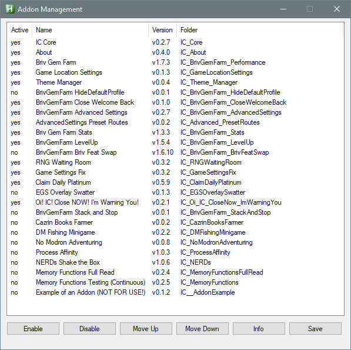
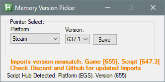
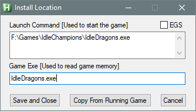

# Requirements

Script Hub requires that you have [Autohotkey](https://www.autohotkey.com/) downloaded and installed.

> [!IMPORTANT]
> *You must use the `deprecated` version - preferably `1.1.37.02`. Script Hub will not work with anything higher than that.*

The Briv Gem Farm script also requires that you have Briv and a Modron.

# Downloading Script Hub

1. Go to the [main page of Script Hub's GitHub](https://GitHub.com/Emmotes/ScriptHub).
2. Click the green `<> Code v` button.
3. Either choose:
   - `Download ZIP` if you want to set it up manually.
   - or `Open with GitHub Desktop` to clone it.
   - or copy the HTTPS URL under `Clone` and clone it in GitHub Desktop manually:
     1. `File`
 	 2. `Clone repository...`
 	 3. `URL` tab.
	 4. Paste the URL into the `Repository URL` box and choose a `Local path`.
	 5. `Clone`.

You can put Script Hub wherever you like. It is best if you do not put it in the game folder or AutoHokey's install folder or any windows protected folder. `C:\ScriptHub\` would be perfectly acceptable.

# First Time Running

Run the `ICScriptHub.ahk` file in the main folder.

## 1. Addons

You will be presented with two windows.
1. The main `IC Script Hub` window which will be mostly blank.
2. The `Addon Management` menu and it will look similar to this:

> [!CAUTION]
> *If your Addon Management somehow does not look like the image - specifically with regard to which addons are enabled/disabled - make it look like the image.*

> [!TIP]
> *If your game is installed through Epic Games Store - you may wish to enable the `EGS Overlay Swatter` addon at this stage.*

Then just go ahead and click `Save`.

You will then be presented with a confirmation to save and restart. Click `Yes`.

## 2. Pointers

Immediately after the script reloads you will almost certainly be given a message telling you `Pointer data not found`.  
You will have no option but to click `OK`. This is perfectly normal. The following dialogue box will be the `Memory Version Picker`:

Then pick your game platform and pointer version.
- `Platform`: If your game is installed through Epic Games Store choose `EGS`. Otherwise choose `Steam` (even if you are on CNE).
- `Version`: Just pick the largest value you are able to.

> [!TIP]
> *`Pointer` versions do not update very frequently as they do not need to. Do not be alarmed if they do not match your game version.*

> [!TIP]
> *Do not conflate `Pointers` and `Imports`. They both control memory reading the game but they are different things.*

Once you are done - click `Save`.

## 3. Game Location Settings

Once the script has reloaded - you will see that the `IC Script Hub` window has populated a lot of tabs. The one you will be on initially is `Briv Gem Farm`.  
At the bottom of this tab you will find a button called `Change Game Location`. Click that and a new window will pop up that looks similar to this:

While that menu is active:
1. Make sure the Idle Champions game window is open and loaded.
2. If your game is installed through Epic Games Store tick the `EGS` tickbox.
3. Click `Copy From Running Game`.
4. Click `Save and Close`.

## 4. Imports

Once you have finished with your Game Location Settings - you will want to click on the `About` addon tab because you will need to update your Imports.  
As long as your game is open - you should be able to click the `Download Imports` button - and that will update them.

If `Download Imports` fails for some reason - then you will need to acquire them manually. You have two choices:
1. Download the correct ZIP from the [#Import Updates Thread](https://discord.com/channels/357247482247380994/1067219380078907463) in the [#scripting](https://discord.com/channels/357247482247380994/474639469916454922) channel in the [Official Idle Champions Discord](https://discord.gg/idlechampions).
2. Get them from the [ic_scripting_imports GitHub repository](https://github.com/Emmotes/ic_scripting_imports).

Imports must be placed in the `[Script Hub Folder]\AddOns\IC_Core\MemoryRead\` folder - and you replace the `Imports` folder already there with the `Imports` folder from the zip.

# Adventure

Now that you should have the script installed - if not yet configured - it's time to figure out where you should be farming.  
Thankfully - this is easy.
1. Go to the [Briv Scripting Routes](https://emmotes.github.io/ic_scripting_routes/) site [Gem Farming Routes](https://emmotes.github.io/ic_scripting_routes/#gemTab) tab.
2. Fill out your Briv's details.
3. Read the resulting information.
4. Make Script Hub's `BrivGF Advanced` addon tab's `Preferred Briv Jump Zones` `Mod 50` section matches the route you will be using. You can achieve this manually or automatically by using the `Route Presets` at the bottom and then `Set Route and Save`.

# Formations

Now that you know which adventure you will be farming in - go there in-game and set up your formations. Again this is easy.
1. Go to the [Briv Scripting Routes](https://emmotes.github.io/ic_scripting_routes/) site [Example Formations](https://emmotes.github.io/ic_scripting_routes/#formsTab) tab.
2. Fill out your details.
3. Read the resulting information.
4. Copy the formation images into your game.
5. Do **NOT** save feats to formations except in the Modron formation. (Do not conflate that with equipped feats. Feats must absolutely be equipped.)

> [!NOTE]
> *Melf and Dynaheir+Co `Quest Champions` setups require ilvl investment and so BBEG is the usual go-to before your Briv is 7 or 8 jump.*

> [!NOTE]
> *`Feat Swapping` is not something you will need to do until you get to a Briv jump of 5.*

> [!NOTE]
> *`Stacking Mode: Offline` will generally be the go-to stacking method until around 4-6 jump Briv.*

# Configuration

Now that you've got your adventure chosen and your formations setup - it's time to configure some settings.

## In-Game

Make sure your level up mode is set to `x100`. The `Game Settings Fix` addon will correct this for you eventually if it is wrong - but it is best to get it right early.

There are also two primary pieces of information you need from your game.
1. The `favour exponent` of the campaign you are currently running - such as Corellon for Witchlight. You are looking for the value after the `e`. For example for `1.79e23` - the exponent is `23`.
2. The `gold find exponent` on zone 1 without any Ellywick Moon cards. This is the smaller lower number in the top-left menu of the adventure.

> [!IMPORTANT]
> *If you have not enabled Scientific Notation - what are you doing? Enable it by pressing the `Y` hotkey in-game.*

Both of those pieces of information are used for deciding where your `Modron Reset Zone` is.
1. You use your `favour exponent` for determining the `Rush cap` for Thellora. With her `Thin Their Ranks` feat equipped - it is `5 x [favour exponent]`. This will be the minimum value for your modron reset zone. Resetting below this is **strongly** discouraged (it invites inconsistency - ask in Discord if you want to know why).
2. You use your `gold find exponent` to determine your `Click Wall` - which is to say the highest zone your click damage can kill things in 1 hit. Beyond that - a gem farm will slow down dramatically. You determine an approximation of your click wall with `[gold find exponent] * 7.63`. This will be the maximum value for your modron reset zone.

Once you know your `Rush cap` and your `Click Wall` - you can choose where to modron reset. It can be anywhere between those two values. Generally speaking if you are offline stacking you will want to reset nearer your `Click Wall` - and hybrid stacking will want to stack closer (but not at) `Rush cap`.

> [!TIP]
> *There is one caveat to offline stacking. You want to make sure you get enough stacks from ONE offline stack to do one or multiple runs. Stacking multiple times in the same run is bad. So - if your `Target Stacks` (discussed in the next section) are too high to be attainable - you may wish to lower your reset zone until the required stacks are enough.*

## Briv Gem Farm

There are four main settings here that you will want to make sure are correct for your setup. The others you can largely leave default.

1. `Minimum Stack Zone`: This should be set to the lowest zone where the W (Fav:2) formation cannot kill anything (plus about 5-10 zones in-case of event buffs or weekend buffs).
   - Do not make up the value you put in this setting. It is for recovery runs where Briv doesn't have any stacks. The script will have to crawl to this zone so you want it to be as low as possible.
   - If it is too low - Briv will kill and he'll get no stacks.
   - If it is too high - it's possible your team will never get there - or it will just take forever.
   - You never want to need this setting - but it's better to have it and not need it - than need it and not have it.
2. `Farm Steelbones stacks AFTER this zone`: You can stack anywhere between your `Minimum stack zone` and two Briv jumps prior to your `Modron Reset Zone`.
   - Note that I said `two Briv jumps prior` and NOT `two zones prior`. For example a 3j Briv can move 4 zones per jump - skipping 3 zones and landing on the one after. So 2 jumps for 3j will be 8 zones prior to your reset.
   - However - also note that this setting says `AFTER` - it cannot stack on the zone you set. So if you were 100% 3j and your reset was z300 - you would want to set *at most* `291`. These are just example numbers - do not copy them.
   - If you are running `Doubles` or `Triples` (stacking once and gaining enough stacks to do two or three runs respectively) - you will need to stack later (nearer the modron reset) in a run for consistency.
3. `Time (ms) client remains closed to trigger Restart Stacking`: This is how long the script delays before starting the game again after turning it off to do offline stacking. You want this to be as low as it can possibly be while still triggering the offline calculation simulation every single time.
   - `6000`ms is the default and should be more than enough for most people - though some may need to increase it. Most will want to reduce it.
4. `Target haste stacks for next run`: This is your `Target Stacks`. To determine this you go to [Briv Scripting Routes](https://emmotes.github.io/ic_scripting_routes/) site [Stacks Calculator](https://emmotes.github.io/ic_scripting_routes/#stacksTab) tab.
   1. Fill in your details.
   2. Read the resulting information.
   - Never make up this value. Always refer to the site and use the exact value it says.

## BrivGF Advanced

As discussed earlier in the Adventure section - make sure that the `Preferred Briv Jump Zones` `Mod 50` section matches the route from the [Briv Scripting Routes](https://emmotes.github.io/ic_scripting_routes/) site. This is important because otherwise you may end up hitting bad bosses.

You can leave the rest of the settings as default until you start delving into hybrid stacking.

## BrivGF LevelUp

You should be able to leave all of the settings here alone - but there are a few to pay attention to.

### Min/Max Settings

- `Widdle`: Once you hit 4j you will want to change Widdle's `Max` level to `300`. It no longer gets you her specialisation - so she will need more ilvls - but it avoids unnecessary levelling.
- `Briv`: You may need to lower his `Max` from `1300` to a number you can afford on zone 1 or Thellora's Rush zone. A number higher than that can confuse the script and cause failed runs.
   - For offline stacking - it should be as high as you can afford early.
   - For hybrid stacking it should be `200` at most.

### General Settings

- `Delay (ms)`: A delay of `0` ms is generally preferred but some potato machines might struggle with random over or under levelling. If you encounter this - you may wish to increase it to `50` or `100` or something like that. You will need to test.
- `Minimum area to reach before leveling Briv`: This is often referred to as `Combining` or `Not-Combining` Briv and Thellora. To combine you set a value of `1`. To not-combine you set a value of `2`.
   - `Combining` will land Thellora on zone `favour + Briv + 1`.
   - `Not-Combining` will land Thellora on zone `favour + 1`.
   - This is the primary mechanism with which to avoid landing on bosses with Thellora and is incredibly important.

### Fail Run Recovery Settings

- `Level champions to soft cap after failed conversion`: Unfortunately this will increase your `Minimum stack zone` mentioned earlier because it increases your champions' damage. It is often unnecessary and can be turned off - but some people may need it to be able to even reach their minimum stack zone. So - this will be something you will have to test.

## RNG Waiting Room

This addon controls what we call `EllyWaiting` - which is to say - waiting on Thellora's landing zone for Ellywick to some Gem cards. The purpose is to pull as many Gem cards as you can get before the game sends a timed save.

The script will use Ellywick's ultimate to reroll the cards she has picked if they are rubbish. It will also use Dungeon Master's ultimate to refresh Ellywick's ultimate so she has a second chance to reroll.

- `Number of gem cards`: Should be `3` with Ellywick's `Gem` feat - or `2` if you don't have it.
- `Max redraws`: Should be `2` if you use Dungeon Master - or `1` if you do not.
- `Always wait for 5 draws`: This should be off except in the one specific case where you hit a boss on your run very early. By early I mean before Ellywick tends to have 5 cards.
- `On-Demand Card Drawing`: This has nothing to do with gem farming. It is used for favour farming where you want lots of Moon cards for gold find.

## Game Settings Fix

Most of the settings in this addon can be left default. Ones that you may wish to change are marked as `Personal Preference` in the `Recommended` column.

You can hover over the name in the `Setting` column for a tooltip.

## Save Settings

Once you've modified your configuration - make sure you've saved the settings. Several addons have their own save buttons as they were originally independent addons. The settings for `Briv Gem Farm` and `BrivGF Advanced` must be saved via the `Profile` in `Briv Gem Farm` and then via the 💾 icon.

> [!WARNING]
> *In `Briv Gem Farm` - do not use the `Default` profile. Save a proper profile with an actual name. Otherwise you risk losing your settings.*

# First Run

You should now be able to simply press the ▶️ (Play) button in `Briv Gem Farm` and it will do its thing.

There are a myriad possible reasons why the script will do strange things beyond this point - so if you need further help go to the [#scripting](https://discord.com/channels/357247482247380994/474639469916454922) channel in the [Official Idle Champions Discord](https://discord.gg/idlechampions) and ask for help.

> [!IMPORTANT]
> *You will almost certainly be asked to provide screenshots of each and every addon tab to help diagnose an issue - so just be prepared for that.*